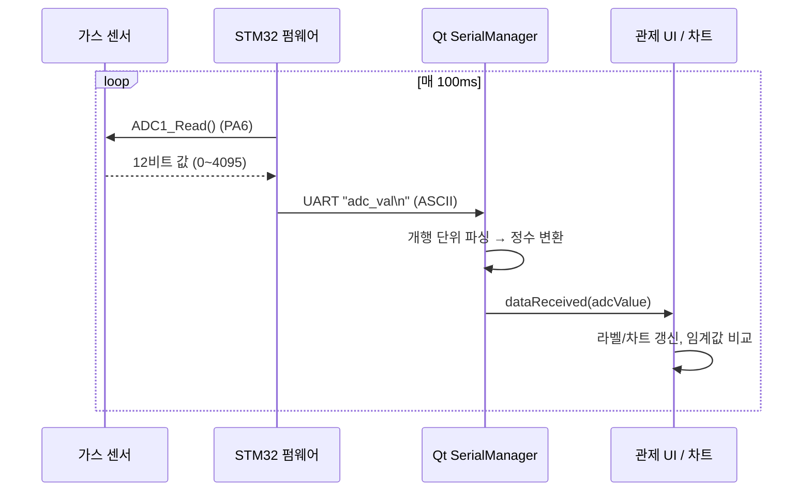
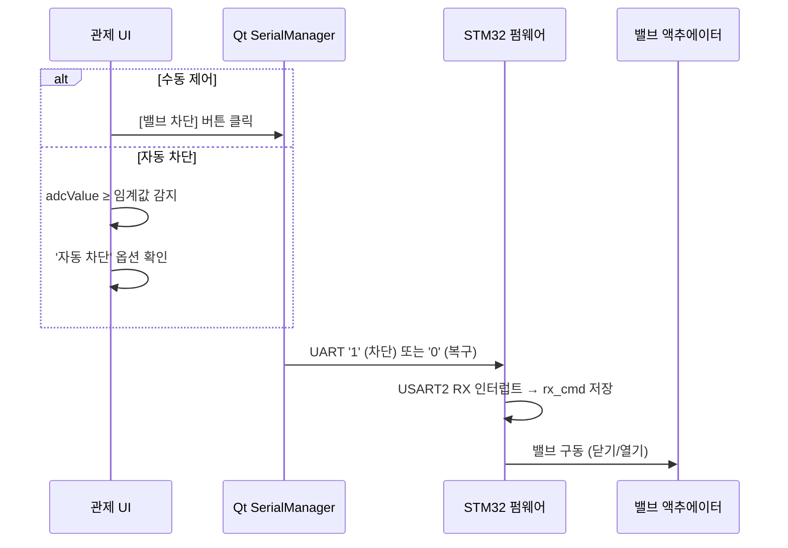
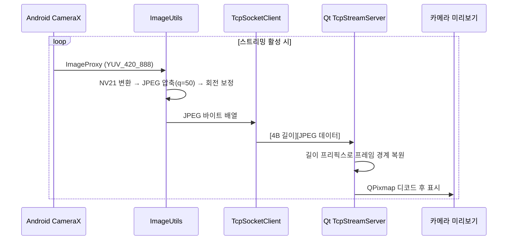
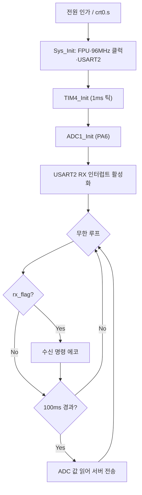
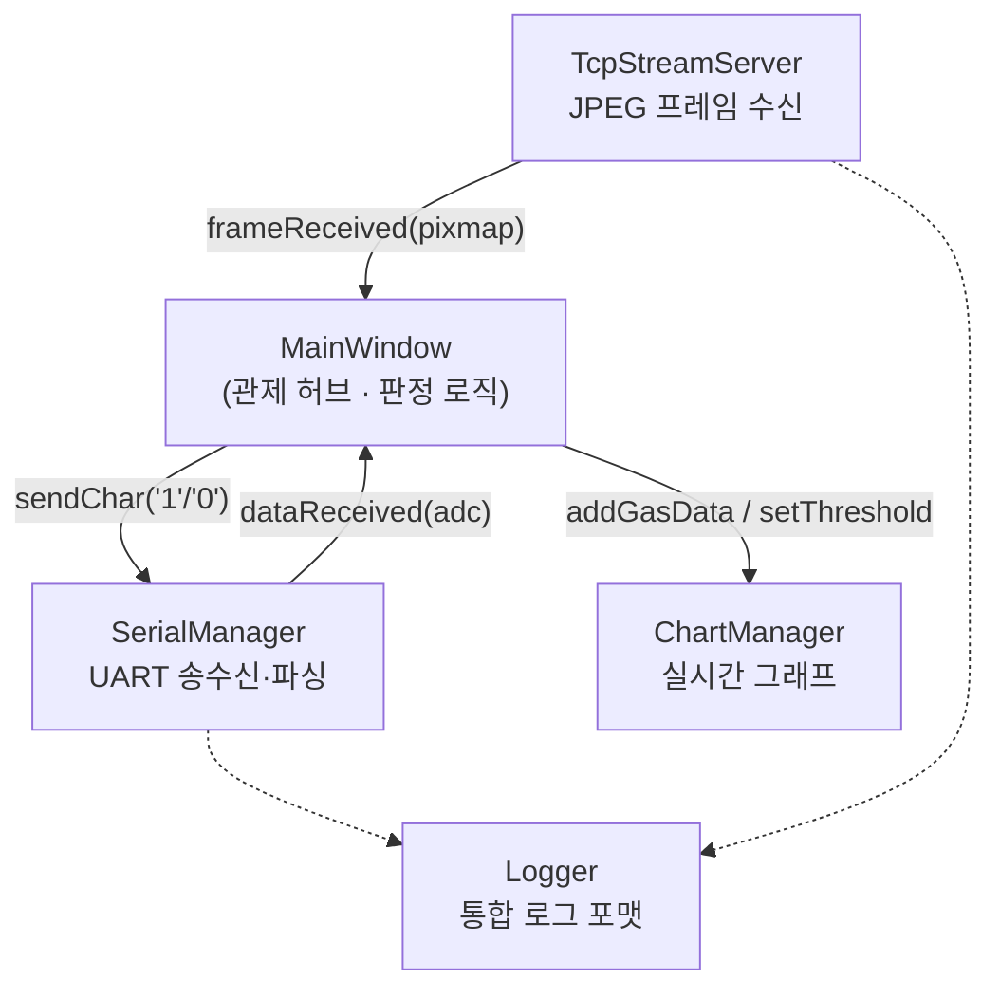
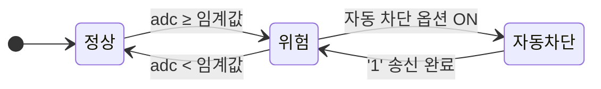
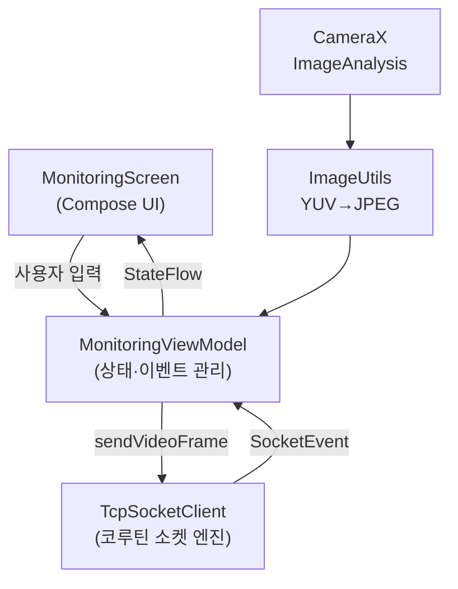

**AI 시스템반도체 SW개발자(2기)**

### **프로젝트 결과보고서**

# 스마트 가스 모니터링 시스템 상위 설계서 v1.0

> Smart Gas Monitoring System — High-Level Design Document
분석 대상 저장소: [96hckim/smart-monitoring-system](https://github.com/96hckim/smart-monitoring-system)
> 

<aside>

1팀

장태희, 박수민, 김호철, 한규리

</aside>

## 0. 목차

1.주제 및 결과 요약

2.개발 목표 및 개발 결과

3.핵심 기술

4.결과 분석 및 기대 효과

5.향후 연구 과제

6.프로젝트 수행 후기

## 1. 주제 및 목표

## 1-1 주제

- 본 문서는 STM32 펌웨어, Qt 데스크톱 서버, Android 모바일 앱의 3계층으로 구성된 **스마트 가스 모니터링 시스템**의 상위 설계(아키텍처 설계)를 기술한다. 개별 함수나 레지스터 수준의 상세 설계가 아니라, 시스템을 구성하는 각 노드의 **책임 분담**, 노드 간 **인터페이스와 통신 프로토콜**, 그리고 **데이터 흐름**을 정의하는 것을 목표로 한다.

## 1-2 목표

- 하드웨어 응답성 확보를 위한 **비동기 이벤트 기반 시리얼 패킷 프로토콜** 설계
- 원격 통신 인프라 확장을 위한 **소켓 기반 데이터 스트리밍 및 클라이언트 네트워크 아키텍처** 구현
- 실시간 모니터링 대시보드 구축 및 **멀티스레딩 기반 UI 반응성 개선**

## 1-3 시스템 개요

본 시스템은 가스 누출을 실시간 감시하고, 위험 수치 도달 시 밸브를 자동 차단하며, 동시에 현장을 영상으로 확인할 수 있는 **원격 가스 안전 관제 시스템**이다.

- **가스 계측**: STM32가 가스 센서를 ADC로 주기 계측하여 서버로 전송
- **밸브 제어**: 서버가 수동 버튼 또는 임계값 초과 시 자동으로 밸브 차단/복구 명령 송신
- **영상 감시**: Android 폰 카메라 영상을 서버로 스트리밍하여 현장 상황 육안 확인

세 노드는 **서로 다른 두 개의 전송 매체**로 연결된다. STM32와 서버는 USB 시리얼(UART)로, 서버와 Android는 무선 네트워크(TCP/IP)로 연결되며, **Qt 서버가 두 전송 매체를 잇는 게이트웨이** 역할을 한다.

## 2.개발 목표 및 개발 결과

## 2-1 개발 목표

- STM32에서 측정된 가스 센서 데이터를 PC에서 실시간으로 확인할 수 있도록 한다.
- 사용자가 GUI를 통해 현재 가스 상태를 직관적으로 확인할 수 있도록 한다.
- 설정된 임계값을 기준으로 위험 상황을 자동으로 판단한다.
- 위험 상황 발생 시 밸브를 자동으로 차단할 수 있도록 한다.
- 사용자가 직접 밸브를 차단하거나 복구할 수 있는 수동 제어 기능을 제공한다.
- 가스 수치 변화를 실시간 차트로 확인할 수 있도록 한다.
- TCP 통신을 이용하여 영상 데이터 및 클라이언트 연결 상태를 관리한다.
- 통신 상태와 주요 동작 내용을 로그로 기록하여 시스템 상태를 쉽게 확인할 수 있도록 한다.

## 2-2 개발 결과

| 기능 | 담당 모듈 | 상태 |
| --- | --- | --- |
| 가스 센서 측정 | STM32 / ADC | ✅ |
| UART 통신 | SerialManager | ✅ |
| TCP 통신 | TcpStreamServer | ✅ |
| 가스 수치 표시 | MainWindow | ✅ |
| 실시간 차트 | ChartManager | ✅ |
| 임계값 설정 | MainWindow | ✅ |
| 위험 상태 판단 | MainWindow | ✅ |
| 자동 차단 명령 | MainWindow → SerialManager | ✅ |
| 수동 밸브 제어 | MainWindow | ✅ |
| 영상 표시 | TcpStreamServer → MainWindow | ✅ |
| 통신 로그 | Logger | ✅ |
| 실제 밸브 액추에이터 연동 | STM32 Motor | 🔧 확장 |

## 2.3 구성도


## 2.4 계층별 책임

| 계층 | 주 책임 | 하지 않는 것 |
| --- | --- | --- |
| STM32 펌웨어 | 물리 계측·구동 (센서 읽기, 밸브 구동) | 임계값 판정, 데이터 저장 |
| Qt 서버 | 판정·중계·관제 (임계값 비교, 자동 차단, 시각화) | 물리 계측, 영상 촬영 |
| Android 앱 | 영상 취득·전송 | 가스 판정, 밸브 제어 |

---

# 3. 데이터 흐름

## 3.1 흐름 A — 가스 계측 (업링크)



## 3.2 흐름 B — 밸브 제어 (다운링크)



## 3.3 흐름 C — 영상 스트리밍



---

# 4. 인터페이스 및 프로토콜 정의

## 4-1. 시스템 동작 결과

| 상황 | 시스템 동작 |
| --- | --- |
| 정상 가스 수치 | 정상 상태 표시 |
| 가스 수치 상승 | 차트 및 수치 실시간 갱신 |
| 임계값 초과 | 위험 상태 표시 |
| 자동 차단 ON | 밸브 차단 명령 전송 |
| 자동 차단 OFF | 위험 상태만 표시 |
| 수동 차단 | `'1'` 명령 전송 |
| 수동 복구 | `'0'` 명령 전송 |
| Android 연결 | 영상 스트리밍 |
| 클라이언트 접속/해제 | 접속자 수 갱신 |

## 4.1 UART 프로토콜 (STM32 ↔ Qt 서버)

| 항목 | 값 |
| --- | --- |
| 물리 계층 | USB Virtual COM Port |
| Baud Rate | 115200 |
| Data / Parity / Stop | 8 / None / 1 |
| Flow Control | None |
| STM32 핀 | PA2 (TX), PA3 (RX) — USART2 |

### 상향 메시지 (STM32 → 서버)

| 형식 | 예시 | 의미 |
| --- | --- | --- |
| `<정수>\n` | `1523\n` | 가스 센서 ADC 값 (0 ~ 4095) |
| `<문자>\n` | `1\n` | 수신 명령 에코 (디버그용) |

### 하향 메시지 (서버 → STM32)

| 문자 | 의미 |
| --- | --- |
| `'1'` | 밸브 차단 (가스 유로 닫기) |
| `'0'` | 밸브 복구 (가스 유로 열기) |

## 4.2 TCP 영상 프로토콜 (Android ↔ Qt 서버)

| 항목 | 값 |
| --- | --- |
| 전송 계층 | TCP/IP (WiFi) |
| 기본 포트 | 8080 |
| 기본 대상 IP | 192.168.137.1 (Windows 모바일 핫스팟 게이트웨이) |
| 방향 | Android → 서버 (단방향) |

---

# 5. 계층별 상세 설계

## 5.1 STM32 펌웨어 계층

### 5.1.1 하드웨어 구성

| 자원 | 용도 |
| --- | --- |
| STM32F411RE | 전체 엣지 노드 제어 (96MHz PLL) |
| ADC1 / PA6 | 가스 센서(가변저항) 아날로그 입력, 12비트 |
| USART2 / PA2·PA3 | 서버와 명령·데이터 송수신 |
| TIM4 | 1ms 시스템 틱 생성 (계측 주기 기준) |
| TIM5 / PA0·PA1 | 밸브 액추에이터(DC 모터) PWM 구동 |

### 5.1.2 실행 계층 (현재 Main Loop 기준)



- `main.c`의 활성 실행 경로: **가스 계측(ADC) + 명령 수신(UART 인터럽트)** 구성
- 계측은 `Sys_Tick` 100틱(=100ms)마다 이루어지며, 수신 명령은 인터럽트에서 플래그로 저장한 뒤 메인 루프에서 처리하는 **ISR 최소화 패턴**을 따름

### 5.1.3 드라이버 모듈 구성

| 파일 | 역할 | 현재 활성 여부 |
| --- | --- | --- |
| `main.c` | 초기화 및 계측·명령 루프 | 활성 |
| `adc.c` | 가스 센서 ADC 계측 | 활성 |
| `uart.c` | USART2 초기화 및 RX 인터럽트 | 활성 |
| `timer.c` | TIM2/3/4/5 (틱·PWM·WS2812B) | TIM4 활성 |
| `exception.c` | 각 인터럽트 서비스 루틴 | 활성 |
| `clock.c` | 96MHz PLL 시스템 클럭 | 활성 |
| `motor.c` | 밸브 액추에이터(DC 모터) PWM 제어 | 확장 (명령 정의됨) |
| `dma.c` | M2M·USART TX·TIM DMA 전송 | 확장 |
| `i2c.c` / `spi.c` | SC16IS752 확장 GPIO/UART | 확장 |
| `ws2812b.c` | 상태 표시용 RGB LED | 확장 |
| `led.c` / `key.c` | 보드 LED·버튼 | 확장 |

> **설계 노트**: 밸브 물리 구동은 `motor.c`의 정회전/역회전 제어가 담당하도록 설계되어 있고 UART 명령 규약(`'1'`/`'0'`)도 정의되어 있으나, 현재 `main.c` 기준 루프는 수신 명령을 에코하는 단계까지 구현
> 

## 5.2 Qt 데스크톱 서버 계층

### 5.2.1 모듈 구성



- 서버:  **MainWindow를 중심 허브, 통신·시각화 책임을 전담 모듈로 분리**
- 각 통신 모듈:  Qt의 시그널/슬롯으로 MainWindow에 이벤트를 올림
- MainWindow :  판정과 UI 갱신을 담당

| 모듈 | 책임 |
| --- | --- |
| `MainWindow` | UI 통합, 임계값 판정, 자동 차단 결정, 상태 배지 |
| `SerialManager` | COM 포트 연결, 라인 단위 파싱, 밸브 명령 송신 |
| `TcpStreamServer` | TCP 리슨, 길이 프리픽스 기반 프레임 재조립, JPEG 디코드 |
| `ChartManager` | 최근 50개 슬라이딩 그래프, 임계값 기준선 |
| `Logger` | `[시각][카테고리][레벨] 메시지` 형식 통합 로깅 |

### 5.2.2 관제 판정 로직



- 가스 수치 수신 시마다 서버는 임계값과 비교하여 상태 배지(정상=초록 / 위험=빨강)를 갱신
- '자동 차단' 옵션이 켜져 있고 수치가 임계값 이상이면 밸브 차단 명령(`'1'`)을 자동 송신

### 5.2.3 사용 기술

| 항목 | 내용 |
| --- | --- |
| 프레임워크 | Qt Widgets (C++17) |
| 사용 모듈 | core, gui, widgets, network, serialport, charts |
| 통신 | QSerialPort(시리얼), QTcpServer(영상) |

## 5.3 Android 앱 계층

### 5.3.1 구조 (MVVM)



- Android 앱: Jetpack Compose + MVVM 구조
- 분리 - UI(`MonitoringScreen`), 상태 관리(`MonitoringViewModel`), 네트워크 엔진(`TcpSocketClient`)

| 구성요소 | 책임 |
| --- | --- |
| `MonitoringScreen` | 연결 설정·카메라 미리보기·로그 UI (Compose) |
| `MonitoringViewModel` | 연결/스트리밍 상태, 로그, 이벤트 수집 |
| `TcpSocketClient` | 코루틴 기반 TCP 연결·송수신, 길이 프리픽스 전송 |
| `ImageUtils` | CameraX YUV_420_888 → NV21 → JPEG, 회전 보정 |
| `CameraX` | 후면 카메라 프레임 분석 (최신 프레임 우선) |

### 5.3.2 동작 특징

- 카메라 권한 요청 후 CameraX `ImageAnalysis`로 프레임을 받아 **연결·스트리밍 상태일 때만** 전송한다.
- `STRATEGY_KEEP_ONLY_LATEST` 전략으로 밀린 프레임을 버려 지연 누적을 방지한다.
- 소켓 이벤트(연결/해제/수신/오류)는 `SharedFlow`로 ViewModel에 전달되어 로그로 표시된다.

---

# 6. 대표 운용 시나리오

## 6.1 정상 감시

1. PC가 모바일 핫스팟을 켜고 Qt 서버를 시작(포트 8080), STM32와 시리얼 연결한다.
2. Android가 핫스팟에 접속해 서버 IP로 연결 후 영상 전송을 시작한다.
3. STM32는 100ms마다 가스 값을 올리고, 서버 그래프와 상태 배지(정상)가 실시간 갱신된다.
4. 관제자는 서버 화면에서 수치 추이와 현장 카메라를 동시에 확인한다.

## 6.2 가스 누출 감지 및 자동 차단

1. 가스 수치가 상승하여 임계값(예: 3000) 이상으로 진입한다.
2. 서버 상태 배지가 '위험'(빨강)으로 전환된다.
3. '자동 차단' 옵션이 켜져 있으면 서버가 즉시 밸브 차단 명령(`'1'`)을 송신한다.
4. STM32가 명령을 수신하여 밸브를 닫고, 관제자는 카메라로 현장을 육안 확인한다.
5. 수치가 정상으로 회복되면 관제자가 수동으로 밸브 복구(`'0'`)를 지시한다.

---

# 7. 기술 스택 요약

| 계층 | 언어 | 핵심 기술 |
| --- | --- | --- |
| STM32 펌웨어 | C | 레지스터 직접 제어, ADC, UART 인터럽트, PWM, DMA |
| Qt 서버 | C++17 | Qt Widgets, QSerialPort, QTcpServer, QtCharts |
| Android 앱 | Kotlin | Jetpack Compose, MVVM, CameraX, Coroutines/Flow |
| 통신 | — | UART(115200 8N1), TCP/IP(길이 프리픽스 프레이밍) |

---

# 8. 설계 특성 및 확장 지점

## 8.1 강점

- **책임 분리**: 계측(STM32) / 판정·중계(서버) / 영상(Android)이 명확히 분리되어 각 노드가 단순하다.
- **게이트웨이 패턴**: 이기종 전송 매체(시리얼·TCP)를 서버 한 곳에서 통합해 확장에 유리하다.
- **판정 중앙화**: 임계값과 자동 차단 로직이 서버에 집중되어 정책 변경이 용이하다.

## 8.2 확장 지점

| 항목 | 현재 | 확장 방향 |
| --- | --- | --- |
| 밸브 실구동 | 명령 에코 단계 | `rx_cmd` 처리부에 `Motor_Update()` 결합 |
| 영상 채널 | Android → 서버 단방향 | 서버 → Android 가스 상태 푸시 |
| 상태 표시 | 서버 UI 배지 | STM32 WS2812B LED로 현장 경보 표시 |
| 데이터 보존 | 실시간 표시만 | 로그/DB 저장 및 이력 조회 |

---

# 9. 부록 — 저장소 구조

```
smart-monitoring-system/
├── stm32-firmware/     # Edge: STM32F411RE 베어메탈 펌웨어 (C)
│   ├── main.c          # 계측·명령 루프
│   ├── adc.c uart.c    # 센서·통신 (활성)
│   ├── timer.c clock.c exception.c
│   └── motor.c dma.c i2c.c spi.c ws2812b.c   # 확장 드라이버
├── qt-server/          # Gateway: 관제 데스크톱 서버 (C++/Qt)
│   ├── mainwindow.*    # 관제 허브·판정 로직
│   ├── serialmanager.* # UART 브리지
│   ├── tcpstreamserver.* # 영상 수신
│   ├── chartmanager.*  # 실시간 그래프
│   └── logger.h
└── android/            # Client: 모바일 영상 클라이언트 (Kotlin/Compose)
    └── app/src/main/java/.../
        ├── MainActivity.kt
        ├── ui/         # MonitoringScreen, ViewModel
        ├── network/    # TcpSocketClient
        └── util/       # ImageUtils
```